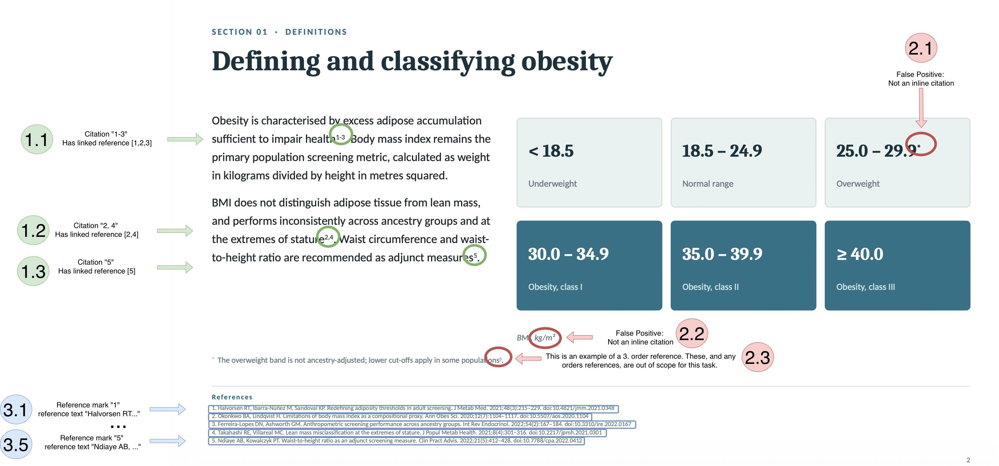

# Agentic RAG over PDFs, with local models

A retrieval-augmented chat backend that answers questions from your PDFs and **cites the original
study**, not just the page it read. It runs fully locally: an agent built with LangGraph, small
open models served by Ollama, Postgres with pgvector, and a five-step ingestion pipeline on
RabbitMQ.

```
"Waist-to-height ratio is recommended as an adjunct measure [S1]."

before:  [S1] → "Test Second Order References 4.pdf p.2"
after:   [S1] → "[5] Ndiaye AB, Kowalczyk PT. Waist-to-height ratio as an adjunct screening
                 measure. Clin Pract Advis. 2022 (cited in Test Second Order References 4.pdf p.2)"
```

## Highlights

- **Agent with a guaranteed search step.** A LangGraph graph (`detect_filters → search → agent`)
  always retrieves before the model answers, so every answer is grounded, even with a 0.8B model
  that would sometimes skip its search tool.
- **Second order references.** When the model cites a chunk that itself cites other research
  (`health1-3`, `stature2,4`, `[31]`), the citation resolves to the entry in that PDF's own
  reference list. Deterministic parsing, no LLM: it cannot invent a reference.
- **Local models by default.** Chat `qwen3.5:0.8b` and embeddings `qwen3-embedding:0.6b` on Ollama.
  Claude on AWS Bedrock is a configuration switch away.
- **Cached, scalable pipeline.** `parse → chunk → embed → citation → index`, one queue and one
  worker service per step, cached on content hash so re-ingesting a file is free.
- **OpenResponses-style API.** `POST /responses` returns the answer with `url_citation`
  annotations, as JSON or a server-sent event stream.

## How the RAG system works

RAG (retrieval-augmented generation) means the model never answers from memory: the system first
**retrieves** the passages that matter, then asks the model to answer **only from them**, and
every sentence points back to its source. Here is the journey of a PDF, then of a question.

### 1. A PDF becomes searchable (ingest)

Uploading a PDF returns immediately (`202`). The work happens in the background, on five workers
connected by RabbitMQ queues:

1. **parse**: PyMuPDF extracts the text, page by page.
2. **chunk**: each page is cut into windows of about **1,200 characters with 150 of overlap**,
   preferring to cut at a paragraph or sentence break, so an idea is rarely split in half.
3. **embed**: each chunk becomes a vector of **1,024 numbers** that captures its meaning
   (`qwen3-embedding:0.6b`). Texts that mean similar things get vectors that point in similar
   directions.
4. **citation**: the chat model extracts the PDF's own title, authors, year and journal, used
   later for filtering.
5. **index**: chunks and vectors are written to Postgres, where an **HNSW index** (pgvector)
   makes "find the closest vectors" fast, even across many thousands of chunks.

Every step's result is cached under a hash of the file's **content**, the step and its version.
Uploading the same bytes again costs nothing, and changing one step only re-runs that step.

### 2. A question finds its evidence (retrieve)

- **Filters:** one quick chat call checks whether the question names an author, year or journal
  (*"what did Chen publish in 2021?"*). A filter is kept only if it really appears in the
  question, and if it matches nothing, the search widens instead of answering "no results".
- **Search, always:** the question is embedded the same way as the chunks, and the **10 closest
  chunks** by cosine distance are returned. This is a fixed step in the agent's graph, not the
  model's choice, so an answer can never skip the evidence.
- **Labelling:** the results are handed to the model as `[S1]` … `[S10]`, each with its file,
  page and text.

### 3. The model answers (generate)

The agent (LangGraph, `qwen3.5:0.8b` by default) is instructed to answer only from the results,
to end every sentence it took from a result with that result's label, and to say so plainly when
the results don't contain the answer. It may search again with different words if the first
results miss something.

### 4. Every claim gets a source (cite)

Each `[Sn]` in the answer is turned into a structured `url_citation` annotation. A label that
points at no real result, which small models sometimes invent, is dropped: no citation is better
than a fake one.

Then the part this project adds: **second order references**. Scientific text is full of claims
that are themselves citations: *"...recommended as adjunct measures⁵"*. Citing "this PDF, page 2"
for that sentence credits the wrong people. So, before the model answers, each retrieved chunk is
scanned for citation marks (`5`, `1-3`, `[2,4]`) and linked to its document's reference list;
after it answers, the model's sentence is matched to the cited sentence it restates, and the
annotation names the **original study**. Details in
[Second order references](#second-order-references).

### Lessons from running it on a 0.8B model

Small local models make every weakness visible, which made them a good test bench:

- **Answers stopped after two words.** Ten retrieved chunks filled the model's default
  4,096-token context window, leaving no room to write. Raising it to 8,192 fixed it: a bigger
  window costs a little memory, while the amount of text the model reads stays the same.
- **The model sometimes skipped the search** and answered from memory, with invented labels like
  `[S4]` and made-up authors. The citation code dropped them, but the answer wasn't grounded. A
  prompt can only ask; the graph now guarantees the search runs.
- **Numbers that look like citations.** `kg/m²` comes out of a PDF as `kg/m2`, and the `2` was
  read as a citation of reference 2. The fix was a general rule: a number is a citation only if
  every number in it exists in that document's reference list.

## Architecture

```
                         ┌──────────────── API (FastAPI) ────────────────┐
  Client ── HTTP ──►     │  POST /responses                               │
                         │   detect_filters → search → agent → citations  │ ──► Ollama (chat + embeddings)
                         │  GET /search · /documents                      │ ──► Postgres + pgvector
                         └──────────────┬─────────────────────────────────┘
                                        │ upload
                                        ▼
                    RabbitMQ ──► parse → chunk → embed → citation → index ──► Postgres
                                  (5 workers)                  ▲
                    Blob store (MinIO / S3Mock) ───────────────┘ the PDFs
```

### How a question is answered

| Step | Where | What happens |
|---|---|---|
| Detect filters | `services/agent/graph.py`, `filters.py` | One chat call: does the question name an author, year or journal? |
| **Search** (always) | `graph.py` `_search` → `tools.py` `run_search()` | Embed the question, vector search over chunks in Postgres |
| Resolve references | `crud/chunk.py` `page_texts()`, `services/agent/references.py` | Rebuild the pages, read each reference list, find citation marks and their sentences |
| Answer | `graph.py` (`create_agent`) | The model answers from results labelled `[S1]…[S10]`; it may search again |
| Cite | `services/agent/citations.py` | Each `[Sn]` becomes an annotation: the original study, or the page if no cited sentence matches |

### Data model

Four tables, defined once in `packages/domain/src/domain/pg/models.py` and created by Alembic:
`document` (one per PDF), `chunk` (text + 1,024-dimension vector, HNSW index), `step_cache`
(each pipeline step's result) and `pipeline_status` (per-step progress log).

## Quickstart

Requirements: Docker with Compose, and optionally [uv](https://docs.astral.sh/uv/) for local
tests.

```bash
docker compose up -d --build                                   # pulls ~3 GB of models on first run
uv sync                                                        # optional: local venv for tests and LSPs
uv run python scripts/seed_pipeline.py samples --timeout 900   # ingest the 5 sample PDFs
```

If the MinIO images cannot be pulled, use the S3Mock override instead:
`docker compose -f compose.yml -f compose.s3mock.yml up -d --build`.

| | |
|---|---|
| API docs (Swagger) | http://localhost:8000/docs |
| RabbitMQ | http://localhost:15672 (guest/guest) |

Ask a question:

```bash
curl -s localhost:8000/responses -H 'content-type: application/json' -d '{
  "model": "small",
  "input": "Is waist-to-height ratio a better screening measure than BMI? Cite your sources using the [S1] labels."
}'
```

A second order annotation looks like:

```json
{"type": "url_citation", "url": "/documents/…#page=2",
 "title": "[2] Okonkwo BA, Lindqvist H. Limitations of body mass index as a compositional proxy. … (cited in Test Second Order References 4.pdf p.2)",
 "start_index": 184, "end_index": 188}
```

## API

| | |
|---|---|
| `POST /documents` | Upload a PDF: blob store, database row, first queue. Returns 202 |
| `GET /documents` | Recent documents |
| `GET /documents/{id}` | One document with its per-step pipeline status |
| `DELETE /documents/{id}` | Row, chunks and blob |
| `GET /search?q=` | Embed the query, nearest chunks via pgvector |
| `POST /responses` | Answer with citations; `"stream": true` for server-sent events |

Layered `routers/` (HTTP) → `services/` (logic) → `crud/` (SQL), with `schemas/` as the wire
contract.

## Second order references

The sample PDFs (`samples/`, five generated documents: journal articles and slide decks) use every
common citation style: superscripts glued to a word (`health1-3`), after a full stop
(`per cent.1–3`), and bracketed (`[1,2]`), with ranges and lists. They also contain look-alikes that
must not count:



| Looks like a citation | What it is |
|---|---|
| `29.9*` | a decimal with a footnote marker |
| `kg/m²` (extracted as `kg/m2`) | a unit |
| `populations5` inside a footnote | a third order reference, out of scope |

The core rule: **a number is only a citation mark if every number in it exists in that document's
reference list**, plus a few targeted rules for decimals, units and footnotes. The model's sentence
is then matched to the cited sentence it restates (shared key words), so a citation only carries
the sources of the claim it supports. With no clear match it keeps the plain page citation: a
wrong source is worse than none.

Full write-up, design decisions, testing and limitations: [`solution/SOLUTION.md`](solution/SOLUTION.md).

## Configuration

Settings are `APP_`-prefixed environment variables, nested with `__` (see `core.config.Settings`
and `compose.yml`). `APP_CHAT__PROVIDER` and `APP_EMBEDDING__PROVIDER` each take `ollama`
(default) or `bedrock`, independently.

To use Claude on Bedrock, add a compose override that mounts your AWS credentials:

```yaml
# bedrock.yml
x-aws: &aws
  volumes:
    - ~/.aws:/home/nonroot/.aws:ro
  environment:
    APP_CHAT__PROVIDER: bedrock
    APP_CHAT__REGION: eu-central-1
    APP_EMBEDDING__PROVIDER: bedrock
    APP_EMBEDDING__REGION: eu-central-1
    AWS_PROFILE: <your profile>
    AWS_REGION: eu-central-1

services:
  api:               {<<: *aws}
  pipeline-citation: {<<: *aws}
  pipeline-embed:    {<<: *aws}
```

Then run `docker compose -f compose.yml -f bedrock.yml up -d`. The embedding step, the slowest,
scales on its own: `docker compose up -d --scale pipeline-embed=4`.

## Tests

```bash
uv run pytest             # 84 tests, offline: no Docker, broker or model needed
uv run ruff check .
uv run basedpyright
```

`tests/test_samples.py` runs the 5 sample PDFs through the production path (PyMuPDF extraction,
the pipeline's chunker, pages rebuilt from chunks) and checks that every reference list is complete
and every citation mark resolves.

## Project structure

```
.
├── apps
│   ├── api          FastAPI: ingest, semantic search, the agent and chat
│   └── pipeline     five step workers, one per queue
├── packages
│   ├── core         config, chat/embedding/blob/queue clients, hashing, sessions
│   └── domain       value objects, the Postgres schema (SQLAlchemy), Alembic migrations
├── samples          five sample PDFs
├── scripts          seed_pipeline.py: push a folder of PDFs through, print a report
├── solution         design write-up
└── tests            offline tests
```

## Credits

Built on a starter codebase provided for an engineering exercise (the ingestion pipeline, API and
agent scaffold). My work: second order reference resolution (`references.py`, `citations.py`,
`crud/chunk.py`), the fixed search step in the agent graph, the chat model context-window fix, the
S3Mock override, and the tests in `tests/test_references.py` and `tests/test_samples.py`.
